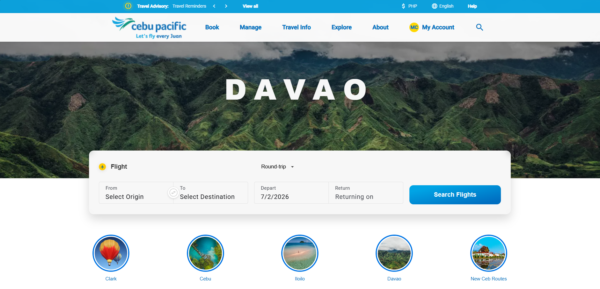
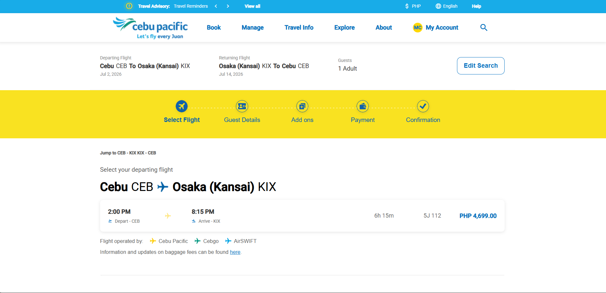
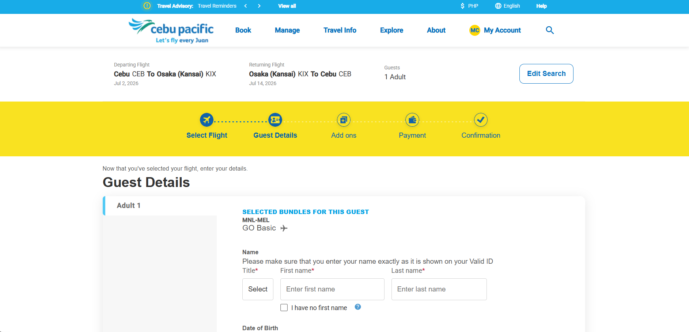
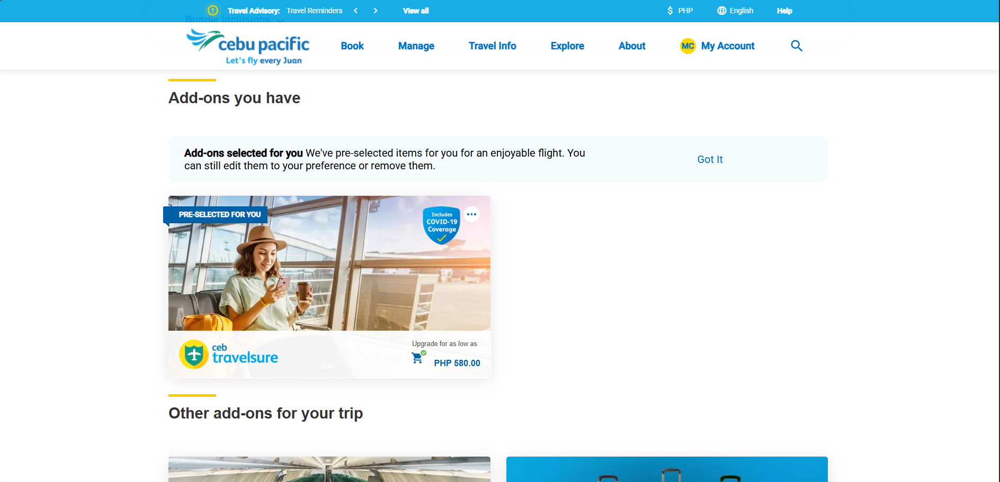
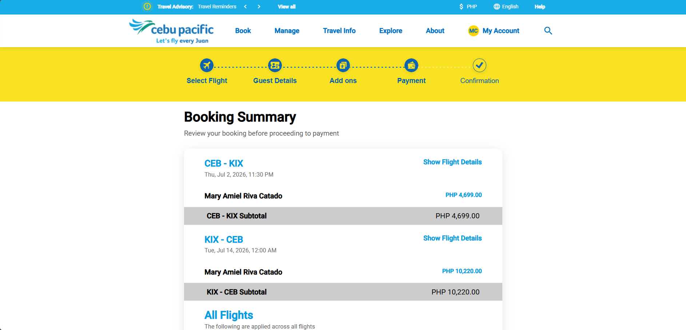
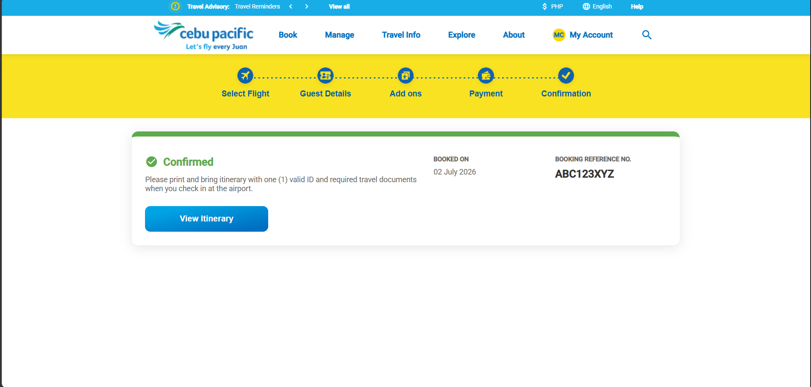

# Airline Booking System

A full-stack airline booking application with an Angular front end and a Django REST Framework back end. Users can search flights by origin/destination and dates, select flights, enter passenger and add-on details, and complete a booking that generates a unique booking reference.

> **Disclaimer:** This project is a **clone of Cebu Pacific Air's** website, built for academic/learning purposes (Apps Dev 2) only. It is not affiliated with, endorsed by, or connected to Cebu Pacific Air in any way, and is not intended for commercial use.

## Screenshots

| Landing Page | Flight Search Results |
| --- | --- |
|  |  |

| Guest Details | Add-Ons |
| --- | --- |
|  |  |

| Booking Summary | Confirmation |
| --- | --- |
|  |  |


## Tech Stack

**Frontend** — `airline-booking-angular/`
- Angular 19 (standalone components)
- TypeScript, SCSS

**Backend** — `airline_booking_django/`
- Django + Django REST Framework
- SQLite (default, via `db.sqlite3`)
- Custom email-based user model (`CustomUser`)

## Project Structure

```
Airline Booking System/
├── airline-booking-angular/   # Angular front end
│   └── src/app/
│       ├── component/         # Reusable UI components (header, footer, date-picker, etc.)
│       ├── pages/              # Route-level pages (flights, guest details, add-ons, confirmation, my-bookings, etc.)
│       ├── models/             # TypeScript interfaces (flight, booking, passenger, etc.)
│       └── services/           # API/auth/booking services
└── airline_booking_django/    # Django back end
    ├── airline_booking_django/ # Project settings & URL config
    └── api/                     # Models, serializers, views, and management commands
```

### Core Data Models
- **CustomUser** — email-based authentication
- **Country / City / Airport** — location hierarchy
- **Flight** — flight number, route, schedule, price, seat availability
- **Booking** — links a user to departing/returning flights, insurance, total price, and a generated booking reference
- **Passenger** — passenger details tied to a booking (adult/child/infant)

## Getting Started

### Prerequisites
- [Node.js](https://nodejs.org/) (LTS) and npm
- [Python 3.12+](https://www.python.org/)
- Angular CLI (`npm install -g @angular/cli`)

### Backend Setup (Django)

```bash
cd airline_booking_django
python -m venv venv
venv\Scripts\activate          # Windows
# source venv/bin/activate     # macOS/Linux

pip install django djangorestframework django-cors-headers

python manage.py migrate
python manage.py createsuperuser   # optional, for /admin access
python manage.py create_mock_flights   # optional, seeds sample flight data
python manage.py runserver
```

The API will be available at `http://127.0.0.1:8000/`.

### Frontend Setup (Angular)

```bash
cd airline-booking-angular
npm install
ng serve
```

The app will be available at `http://localhost:4200/`, and API requests are proxied/pointed to the Django backend.

## Features

- Search flights by origin, destination, and travel dates
- Round-trip and one-way flight selection
- Guest/passenger details form with add-ons (e.g., travel insurance)
- Booking summary and confirmation with a generated booking reference
- User authentication (login/register)
- "My Bookings" view for past/upcoming reservations

## Notes

- This repository consolidates the Angular frontend and Django backend into a single repo (each was previously developed in its own repository).
- `db.sqlite3` is included for local development convenience; delete and re-run `migrate` for a clean database.
